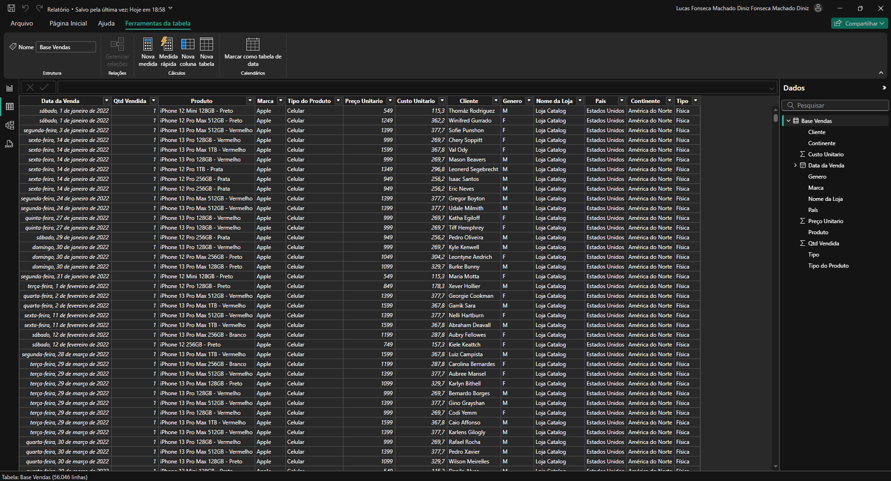
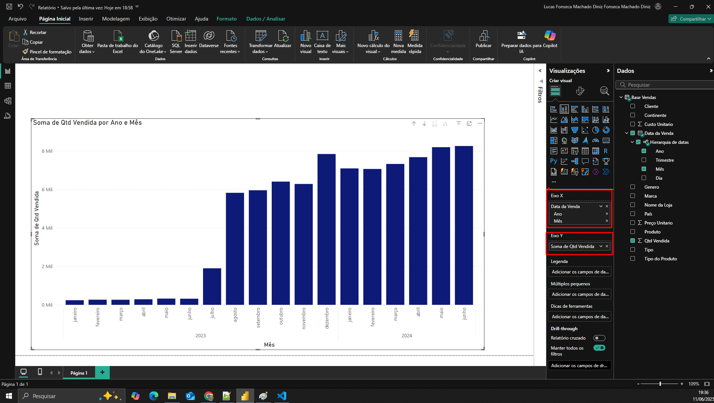
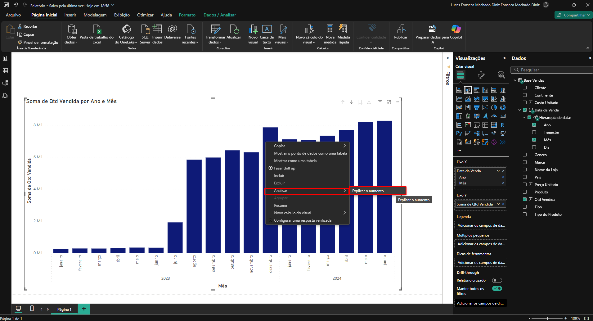

O ideal é fazer o procedimento em algum gráfico que represente indicadores ao longo do tempo, como por exemplo um gráfico que mostra o crescimento de vendas de produtos ao decorrer do passar de alguns meses. 
Para gráficos que não sigam esse padrão pode ser que a análise com IA não funcione.

Observe a tabela que foi carregada para dentro do Power BI:

Observe o gráfico que foi montado dentro do Power BI e repare que a maneira como o gráfico foi montado contribui para a visualização de indicadores ao longo do tempo.

Clique com o botão direito encima de alguma coluna de algum mês, clique em "Analisar" depois em "Explicar aumento"

Uma lista com vários gráficos será exibida, essa lista contém diversas análises feitas por IA, os indicadores geralmente apresentam informações sobre o mês passado/mês atual,é possível rolar para baixo para ver todas as análises. 
Clicando no "+" é possível adicionar o gráfico escolhido ao dashboard. 

Vídeo de Referência:
https://www.youtube.com/watch?v=JMXQr7nxCL8&t=349s

O Link abaixo também contém outro manual:

https://www.hashtagtreinamentos.com/inteligencia-artificial-no-power-bi

Vìdeo Referente ao link:

https://www.youtube.com/watch?v=JBzuHp_QsTs
